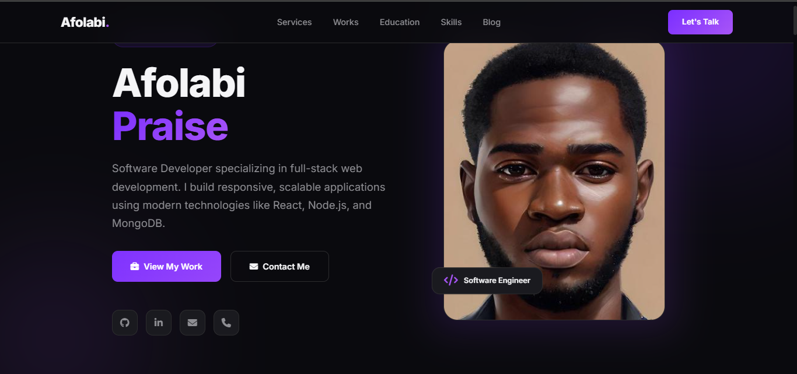

# Praise Afolabi — Portfolio

## Screenshot

<p align="center">
  
</p>

<p align="center">
  
  
</p>

<p align="center">
  <b>Full Stack Developer | Web Developer | React.js | JavaScript | TypeScript | Python</b>
</p>

---

## About Me

Hi, I’m **Praise Afolabi**, a motivated and detail-oriented **Full Stack Developer** based in **Lagos, Nigeria**.

I’m passionate about building clean, responsive, and user-friendly web applications. I enjoy working across both frontend and backend technologies, and I’m always eager to learn, grow, and contribute to team success through hard work, collaboration, and problem-solving.

---

## Contact

- **Location:** Lagos, Nigeria 100001
- **Phone:** 07017253432
- **Email:** afolabipraise43@gmail.com
- **Portfolio:** [officialpryz.github.io](https://officialpryz.github.io/)
- **GitHub:** [officialpryz](https://github.com/officialpryz)

---

## Skills

### Technical Skills
- Web Design
- Web Development
- Backend Development
- Full Stack Development
- Python
- JavaScript
- TypeScript
- React.js

### Professional Skills
- Strategic Sales Knowledge
- Administrative Tasks
- Project Support
- Team Collaboration
- Problem-Solving
- Client Relationships
- Social Media Management
- Brand Development
- Outstanding Communication Skills
- Administrative Support

---

## Experience

### Sale Entrepreneur
- Increased revenue by implementing effective sales strategies throughout the sales cycle, from prospecting to closing.
- Analyzed past sales data and team performance to develop realistic sales goals.
- Researched sales opportunities and potential leads to exceed sales goals and increase profits.
- Developed sales strategies based on consumer buying trends and market conditions.

---

## Education

### Bachelor of Engineering in Petroleum Engineering
**University of Lagos** — Yaba, Lagos

### Certificate in Software Engineering
**Holberton School by ALX**  
Front-End Development

---

## Why This Portfolio

This portfolio represents my professional journey and showcases:
- My technical and creative skills
- My education and training
- My sales and administrative experience
- My growth as a developer
- My ability to collaborate and solve problems effectively

---

## Tech Stack

<p>
  
  
  
  
  
  
</p>

---

## Live Demo

<p align="center">
  <a href="https://officialpryz.github.io/" target="_blank">
    
  </a>
</p>

---

## Repository Structure

```text
my-portfolio/
├── README.md
├── src/
├── public/
└── assets/